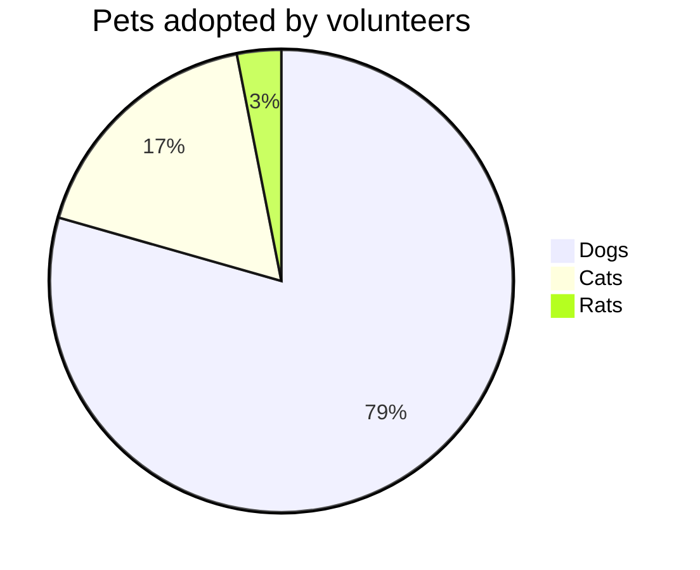
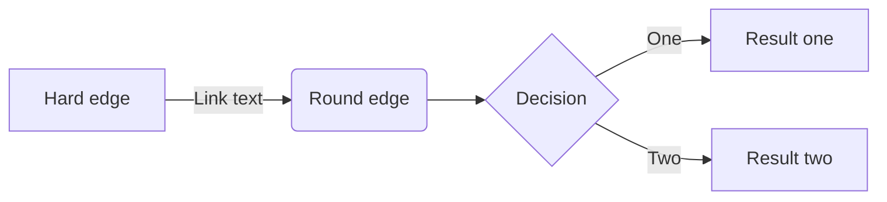

```mermaid
pie title Pets adopted by volunteers
    "Dogs" : 386
    "Cats" : 85
    "Rats" : 15
```

```mermaid  
flowchart TD;  
 A-->B;  
 A-->C;  
 B-->D;  
 C-->D;  
```

矩形

```mermaid
flowchart LR
	id(This is the text in the box)
```

A stadium-shaped node

```mermaid
flowchart LR

id([This is the text in the box])

id2([test2])

id --> id2
```

```mermaid
flowchart LR
    A[Hard edge] -->|Link text| B(Round edge)
    B --> C{Decision}
    C -->|One| D[Result one]
    C -->|Two| E[Result two]
```

```mermaid
flowchart LR
    A[Hard edge] -->|Link text| B(Round edge)
    B --> C{Decision}
    C -->|One| D[Result one]
    C -->|Two| E[Result two]
```
